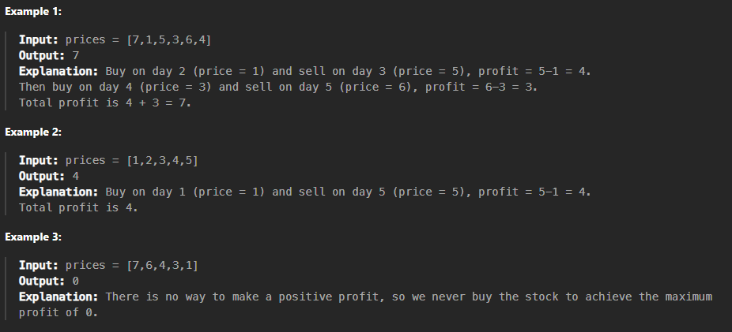
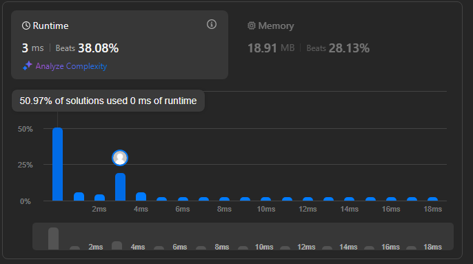

# Questão - 122

## Best Time to Buy and Sell Stock II

You are given an integer array `prices` where `prices[i]` is the price of a given stock on the `i`th day.

On each day, you may decide to buy and/or sell the stock. You can only hold at most one share of the stock at any time. However, you can buy it then immediately sell it on the **same day**.

Find and return the maximum profit you can achieve.

## Exemplos



## Solved



## Código

```python
class Solution:
    def maxProfit(self, prices: List[int]) -> int:
        profit = 0
        for i in range(1, len(prices)):
            if prices[i] > prices[i - 1]:
                profit += prices[i] - prices[i - 1]
        return profit

```