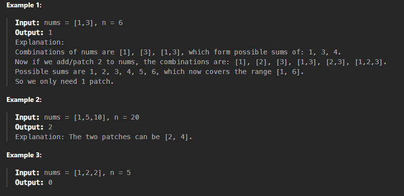

# Questão - 330

## Patching Array

Given a sorted integer array nums and an integer n, add/patch elements to the array such that any number in the range [1, n] inclusive can be formed by the sum of some elements in the array.

Return the minimum number of patches required.


## Exemplos



## Solved


## Código

```python
class Solution:
    def minPatches(self, nums: List[int], n: int) -> int:
        miss = 1
        i = 0
        patches = 0

        while miss <= n:
            if i < len(nums) and nums[i] <= miss:
                miss += nums[i]
                i += 1
            else:
                miss += miss
                patches += 1

        return patches

```