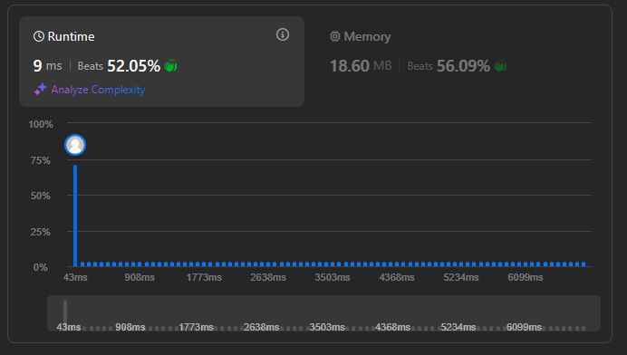

# Questão - 45

## Jump Game II

You are given a 0-indexed array of integers `nums` of length `n`. You are initially positioned at `nums[0]`.

Each element `nums[i]` represents the maximum length of a forward jump from index `i`. In other words, if you are at `nums[i]`, you can jump to any `nums[i + j]` where:

`0 <= j <= nums[i]` and
`i + j < n`
Return the minimum number of jumps to reach `nums[n - 1]`. The test cases are generated such that you can reach `nums[n - 1]`.


## Exemplos


## Solved



## Código

```python
class Solution:
    def jump(self, nums: List[int]) -> int:
        jumps = 0
        current_end = 0
        farthest = 0
        
        for i in range(len(nums) - 1):
            farthest = max(farthest, i + nums[i])
            if i == current_end:
                jumps += 1
                current_end = farthest
        
        return jumps

```